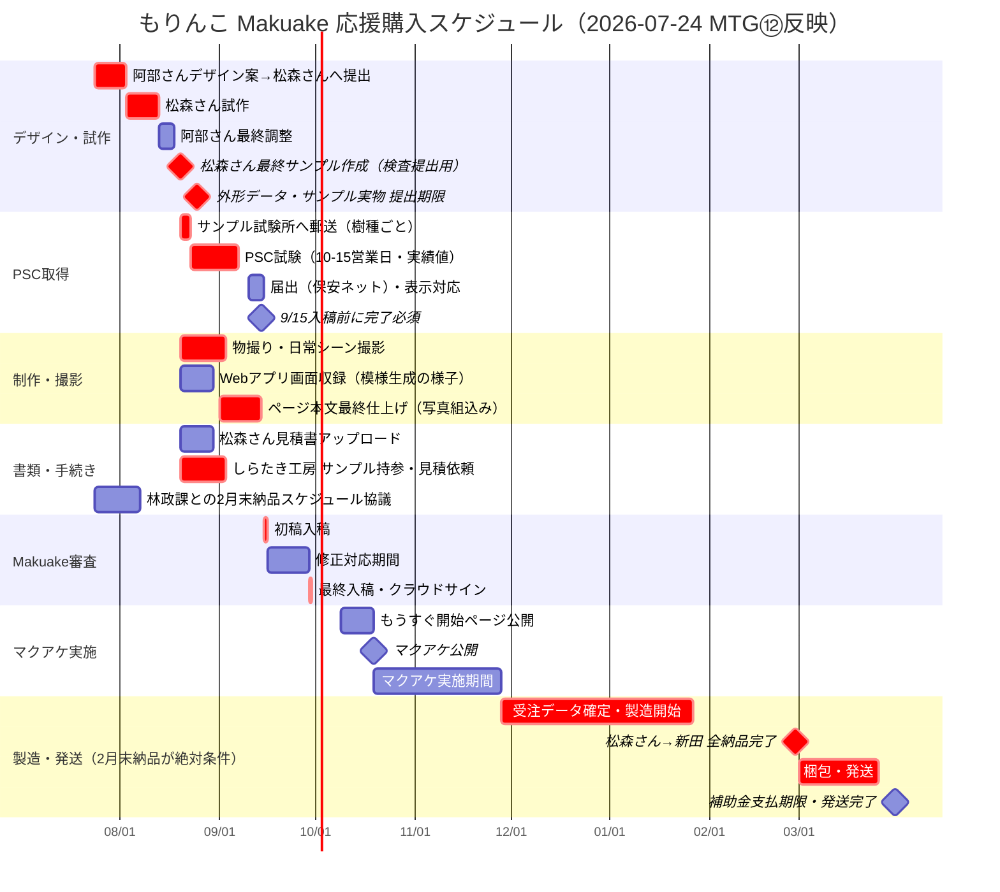

# てもり（もりんこ）｜Makuake 応援購入プロジェクト ガントチャート v3

作成：2026-07-24　更新者：涼子（PM）
※ v2（2026-07-02）は葉形パネル前提のまま止まっていた。MTG⑫（2026-07-22）で形状・工程・原価・スケジュールが確定したため全面更新。

> 🟢 v2で懸案だった「商品名・形状ピボット後の全面改訂」はこのv3で解消。
> 🔴 新たなクリティカルパス：**サンプル完成が8月中〜下旬にずれ込んだ場合、PSC試験→9/15入稿の余裕がほぼゼロになる**（詳細は下記リスク一覧）。

---

## チーム

| 略称 | 担当 |
|------|------|
| 新田 | とうめいしっぽ（企画・販売・広報・レーザー彫刻・塗装） |
| 松森 | 松森木工所（NC加工・切り離し・ルーター仕上げ・面取り・Webアプリ） |
| 阿部 | のはら（デザイン・パッケージ・説明書構成） |
| 本間 | manordaいわて（事業計画・外部調整） |
| しらたき | しらたき工房（サンディング委託候補・未確定） |

---

## 確定済みマイルストーン

| 日付 | 内容 |
|------|------|
| **2026-07-24（今日）** | ← 現在地 |
| 2026-08下旬 | こけし型サンプル実物・外形データ提出期限（松森さん回答） |
| 2026-09-15（火）正午 | ★ Makuake初稿入稿・電子申込書・書類提出 |
| 2026-09-29（火）正午 | ★ Makuake最終入稿・クラウドサイン締結 |
| 2026-10-19（月） | ★★ マクアケ公開（確定） |
| **2027-02末** | ★ 松森さんからの製造物・全納品完了必須（林政課回答・補助金要件） |
| 2027-03-31 | 補助金支払期限（発送完了必須） |

---

## 商品仕様（MTG⑫確定）

- 形状：人型・**1サイズのみ**（全長60mm）。2サイズ展開は今回見送り
- 彫刻：**レーザーのみ**（模様は一注文につき1パターン）
- 4体セット樹種：**スギ・カラマツ・ナラ・クリ**（アカマツから変更／カラマツは盛岡市産材で入手性◎）
- アプリ入力欄に「願い」項目追加（模様への反映方法は要検討）
- 卸売なし。今回は利益より宣伝・告知重視

### 工程分担（新規・重要）

| # | 工程 | 担当 |
|---|------|------|
| 1 | NC外形カット（1mm残し） | 松森 |
| 2 | 手動切り離し | 松森 |
| 3 | ルーター仕上げ | 松森 |
| 4 | レーザー彫刻 | **新田**（取り違い防止のためサンディング前に実施） |
| 5 | サンディング | 松森 or **しらたき工房へ委託検討（未確定）** |
| 6 | 面取り | 松森 |
| 7 | 塗装→サンディング×2 | **新田** |

→ 1体あたり最大4回、新田⇄松森（⇄しらたき）の間を物理的に往復する工程設計。2月末納品までの製造ウィンドウ（約3ヶ月）の中でこの往復ロジスティクスが回るか、要確認。

### 原価目安

| 項目 | 金額 |
|------|------|
| 松森さん加工費（利益込み） | 約2,000円／体 |
| パッケージ・送料 | 約1,200円／4体セット |
| **4体セット原価目安** | **約9,200円**（超早割¥9,800とほぼ同水準） |

---

## ガントチャート

---

## ⚠️ リスク一覧（MTG⑫反映版）

| リスク | 影響 | 対処 |
|--------|------|------|
| **サンプル完成が8月下旬にずれ込むと、PSC試験（10-15営業日）と届出が9/15に間に合わない** | 初稿入稿の書類要件を満たせず、最悪マクアケ公開日が後ろ倒し | 8/20を社内締切として死守。松森さんには「8月下旬」ではなく「8/20目標」で伝える |
| **しらたき工房への委託が2月末納品に間に合うか未検証**（過去実績は別スコープの「9ピース×100セット＝最低半年」） | 製造ウィンドウは実質3ヶ月弱（11/28〜2/28）。半年基準なら根本的に間に合わない | 見積依頼時に「サンディングのみ・219体・11月末〜2月末」という実スコープで正式回答をもらう。NGなら松森さん内製 or 他委託先を今のうちに検討 |
| **工程が新田⇄松森（⇄しらたき）を最大4往復する設計** | 発送・受取のリードタイムが積み上がり、3ヶ月の製造ウィンドウを圧迫 | 往復回数・発送方法（まとめて/都度）を松森さんと具体化。試作段階で1サイクルの所要日数を実測しておく |
| **超早割・早割はMakuake手数料22%控除後、原価9,200円を下回り赤字**（詳細は本文回答②） | 「宣伝重視」方針でも許容範囲か未確認 | 財務ペルソナに正式なP&Lシミュレーションを依頼。許容するなら経営判断として明文化 |
| 9体セット（プレミアム・相談コース）の原価は未確定 | 4体セットの原価目安から比例推定した仮の数字しかない | 松森さんの正式見積り（サンプル完成後）で9体セット原価を確定させる |

---

## 参考：プレスリリース先リスト・発信知見・パッケージアイデア等

→ 変更なし。[`20260702_doc_マクアケガントチャート_draft_v2.md`](20260702_doc_マクアケガントチャート_draft_v2.md) を参照。

---

> v2（2026-07-02作成）は上記ファイルに保存。v1は`20260525_doc_クラファンガントチャート_draft_v1.md`。
