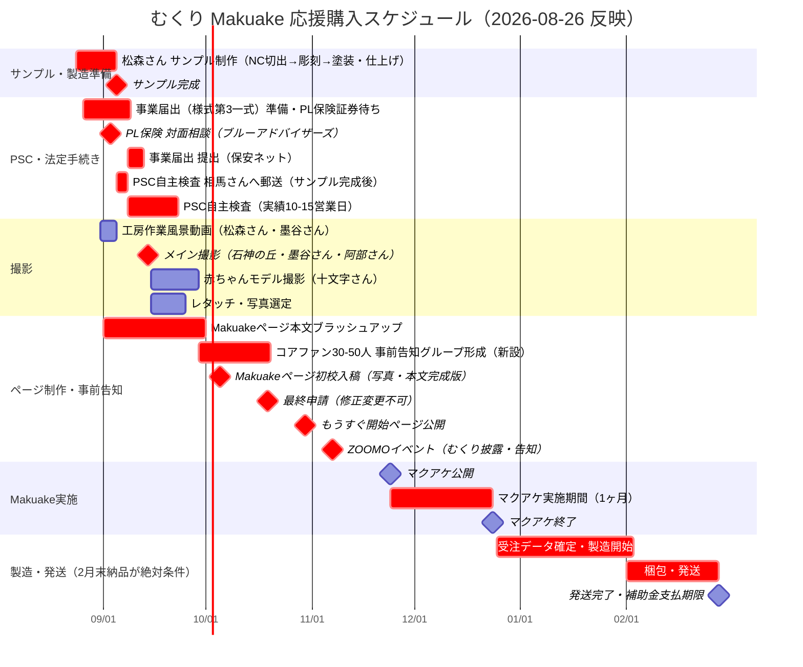

# むくり｜Makuake 応援購入プロジェクト ガントチャート v4

作成：2026-08-26　更新者：涼子（PM）
※ v3（2026-07-24）は公開日10/19・商品名「もりんこ」・60mm・4体セット前提のまま止まっていた。
本間さん打合せメモ（2026-08-10・AZMカフェ）の大枠スケジュールと、8/24〜8/26に確定した実務日程（藤根さん・松森さん・墨谷さん・PSC・PL保険）を統合し全面更新。

> 🟢 v3で懸案だった「商品名・サイズ・公開日の全面改訂」はこのv4で解消。
> 🔴 新たなクリティカルパス：**サンプル完成が9月第1週目に後退**（旧目標8月中）。PSC自主検査（相馬さん郵送・35,000円）のバッファが減っている。
> 🟡 事前告知フェーズ未設計だった問題を解消：11/24公開から逆算し、9月末〜10月頭を事前告知・コアファン形成の開始時期として新設。

---

## 本間さん打合せメモとの整合確認（2026-08-10 AZMカフェ合意分）

| 本間さんMTG合意事項（8/10） | 現在の状況（8/26） |
|---|---|
| 8月中サンプル完成 | ⚠️後退：**9月第1週目**（松森さんより8/24回答） |
| 8/20弁理士相談（商標登録） | 実施済み（別途進行） |
| 9月上旬PSC検査受検 | サンプル完成後ろ倒しに伴い後ろ倒し。届出自体はサンプル非依存で先行可能と判明（経産省確認済み） |
| 9月中ママさんフォトグラファー撮影 | **具体化：メイン撮影9/14（月）道の駅「石神の丘」**（墨谷さん・阿部さん・新田）。赤ちゃんモデルは別枠で十文字さんOK・大内さん回答待ち |
| 9月末〜10月中プロカメラマン撮影 | 墨谷さんが物撮り・イメージ撮影を兼務する形で9/14に統合 |
| **10月頭 Makuakeページ初校提出** | ★据え置き。事前告知フェーズの起点として重要 |
| **11月公開** | **11/24（火）に確定**（藤根さんより正式回答・8/24） |
| **12月中終了（期間1ヶ月）** | **12/24（木）終了に確定** |
| 1月発送開始・2月中完了 | 据え置き（変更なし） |
| 来年度〜一般販売（松森さんと契約見直し後） | 据え置き。補助事業完成を最優先する方針も変更なし |

→ **本間さんとの大枠合意（11月公開・12月中終了・来年度一般販売）とは矛盾なし**。8/24以降判明したのは、その枠内での具体的な日付（11/24・12/24）とサンプル完成の後ろ倒しのみ。

## 8/17付「むくり全体スケジュール.xlsx」との整合確認（マイドライブ）

本間さんMTG（8/10）後に作成された月×旬単位の詳細表。10月のマイルストーンをさらに具体化する内容で、v4に統合。

| Excel記載（8/17作成） | 内容 |
|---|---|
| 10月上旬 | マクアケ初稿入稿（リターン写真複数枚・本文テキスト完成版） |
| 10月中旬（初稿+14日） | 最終申請（修正変更不可） |
| 10月下旬（初稿+25日） | もうすぐ開始ページ公開（47字×3点・★初稿） |
| 2月末 | 全製造完了・納品（新田・松森・阿部 共通締切） |
| 8/19-20 | グッドトイベント（後日撮影モデル募集の記載あり・要確認） |
| **11/7-8** | **ZOOMOイベント**（新規情報。Makuake公開11/24の2週間前＝事前告知施策として使える可能性） |

→ 「初稿10月上旬」は本間さんMTG合意（10月頭初校提出）と一致。最終申請・もうすぐページの日付はv4未反映だったため、下記マイルストーン・ガントに追加。
→ ✅ 8/19-20グッドトイベントの「撮影モデル募集」は**別経路・現在は実施予定なし**と確認済み（8/26サキ回答）。十文字さん・大内さんルートに一本化。
→ ✅ **11/7-8 ZOOMOイベントは、盛岡市森林づかいイノベーション事業の他の補助事業者が集まるイベントと判明（8/26サキ回答）。むくりの披露・告知の場として活用する方針で確定**。Makuake公開（11/24）の2週間前というタイミングは事前告知フェーズの中核イベントとして扱う。

---

## チーム

| 略称 | 担当 |
|------|------|
| 新田 | とうめいしっぽ（企画・販売・広報） |
| 松森 | 松森木工所（NC加工・彫刻・塗装・仕上げまで一貫対応） |
| 阿部 | のはら（デザイン・パッケージ・説明書構成・ロゴ・撮影香盤作成） |
| 本間 | manordaいわて（事業計画・外部調整） |
| 墨谷 | カメラマン（メイン撮影・レタッチ） |
| 十文字 | 赤ちゃんモデル撮影（8/25 OK確定） |

---

## 確定済みマイルストーン

| 日付 | 内容 |
|------|------|
| **2026-08-26（今日）** | ← 現在地 |
| 2026-09第1週目 | こけし型サンプル完成予定（9樹種×各3体） |
| 2026-09-03（木）14:00 | PL保険 対面相談（ブルーアドバイザーズ） |
| 2026-09-14（月） | ★ メイン撮影（道の駅「石神の丘」） |
| 2026-09末〜10月頭 | 事前告知・コアファン形成 開始（新設） |
| 2026-10頭 | ★ Makuakeページ初校入稿（リターン写真・本文テキスト完成版／8/17 Excel記載） |
| 2026-10中旬（初稿+14日） | ★ 最終申請（修正変更不可／8/17 Excel記載） |
| 2026-10下旬（初稿+25日） | ★ もうすぐ開始ページ公開（8/17 Excel記載） |
| 2026-11-07・08 | ★ ZOOMOイベント（森林づかいイノベーション事業 他事業者合同・むくり披露＆告知の場として活用確定） |
| **2026-11-24（火）** | ★★ Makuake公開（確定） |
| **2026-12-24（木）** | ★★ Makuake終了（確定） |
| 2027-01 | 発送開始・梱包作業 |
| 2027-02末 | ★ 発送完了・松森さんからの全納品完了必須（補助金要件） |
| 2027-03-31 | 補助金支払期限 |
| 2027年度〜 | 一般販売開始（松森さんとの契約見直し後） |

---

## 商品仕様（2026-08確定分）

- 商品名：**むくり**（8/10確定）
- 形状：ひとのかたち
- サイズ：**65mm**（7/28確定・v3の60mmから変更）
- 構成：**9樹種×各3体**（1セット検査用・1セット撮影用・1セットはプレゼント可否を松森さんへ相談中）
- 樹種選択：お客様選択なし・セットごと固定（8/24確定）
- 顔（頭部）模様彫刻：前髪の帯＋目という構成で確定（8/15 GO）
- 加工〜塗装・仕上げまで松森さんが一貫対応（しらたき工房は今回のサンプル制作には不関与。しらたきの研磨は量産フェーズの話として整理）

---

## ガントチャート

---

## ⚠️ リスク一覧（v4版）

| リスク | 影響 | 対処 |
|--------|------|------|
| **サンプル完成が2回連続で後退（8月中→9月第1週目）** | PSC検査バッファがさらに縮小 | これ以上の後退は初校提出（10月頭）に直結するリスク。松森さんへの進捗確認頻度を上げる |
| **PL保険が唯一のボトルネック** | 証券取得まで事業届出が完結しない | 9/3対面相談を確実に実施。相談後すぐ加入手続きへ |
| **事前告知フェーズが本間さんMTG合意（10月頭初校提出）とほぼ同時進行** | コアファン形成の準備期間が短い（9月末〜10月頭の実質1〜2週間） | 事前告知グループの母体（GTカフェ・ひろば常連等）は既存接点を使って前倒しで声かけ可能。9月中旬から水面下で候補リストアップを開始する。**11/7-8のZOOMOイベント（公開2週間前）を事前告知の中核イベントとして活用**（森林づかいイノベーション事業の他事業者合同の場で、むくりを実物披露・告知） |
| ~~ZOOMOイベント用の実物確保~~ | ~~3セットの用途が検査用・撮影用・プレゼント用検討で埋まっており展示用が未確保~~ | ✅解消（8/26）：**撮影用セットを9/14撮影後にZOOMOイベント展示用へ転用する方針で確定**。プレゼント用検討（残り1セット）とは独立して進行可 |
| 応援リターン方針転換（500円/1,000円 or 1,000円〜一本化） | 本間さんMTG（8/10）では「1,000円〜で確定」の合意があったが、8/24に藤根さんの事例を受け500円/1,000円の2段階へ再提案・本間さんの再承認待ち | 本間さんには「一度合意した内容を覆す」経緯として説明済み。再承認が得られない場合は8/10合意（1,000円〜一本化）に戻す前提で進行 |
| 一般販売時期（来年度〜）と松森さんとの契約見直し | 本間さんMTGで合意済みだが、契約見直しの着手時期が未設定 | Makuake終了（12/24）後、発送業務と並行して着手時期を松森さんと調整 |
| 9体セット（プレミアム・相談コース）原価未確定 | 松森さんの正式見積り（サンプル完成後）待ち | サンプル完成後、財務ペルソナと確定作業 |

---

## 財務との連携（要すり合わせ）

- 65mm・9樹種・9/14撮影確定を踏まえたP&Lシミュレーション（Makuake手数料22%込み）の再計算、7/24依頼分がまだ未回収
- 応援リターン2段階化（本間さん再承認待ち）の財務反映
- 相談コース3口確定（8/19）の財務反映

---

## 参考

- 本間さん打合せメモ：`打ち合わせメモ：Makuakeプロジェクト「むくり」スケジュール・検討事項.md`（Obsidian `02_事業/むくり/`）
- 8/17付月次スケジュール表：`H:\マイドライブ\とうめいしっぽ_プロジェクト\02_制作・設計\20260817「むくり」全体スケジュール.xlsx`
- v3（2026-07-24作成・もりんこ/60mm前提）は [`20260724_doc_マクアケガントチャート_draft_v3.md`](20260724_doc_マクアケガントチャート_draft_v3.md) を参照
- プレスリリース先リスト・発信知見・パッケージアイデア等は変更なし。[`20260702_doc_マクアケガントチャート_draft_v2.md`](20260702_doc_マクアケガントチャート_draft_v2.md) を参照
