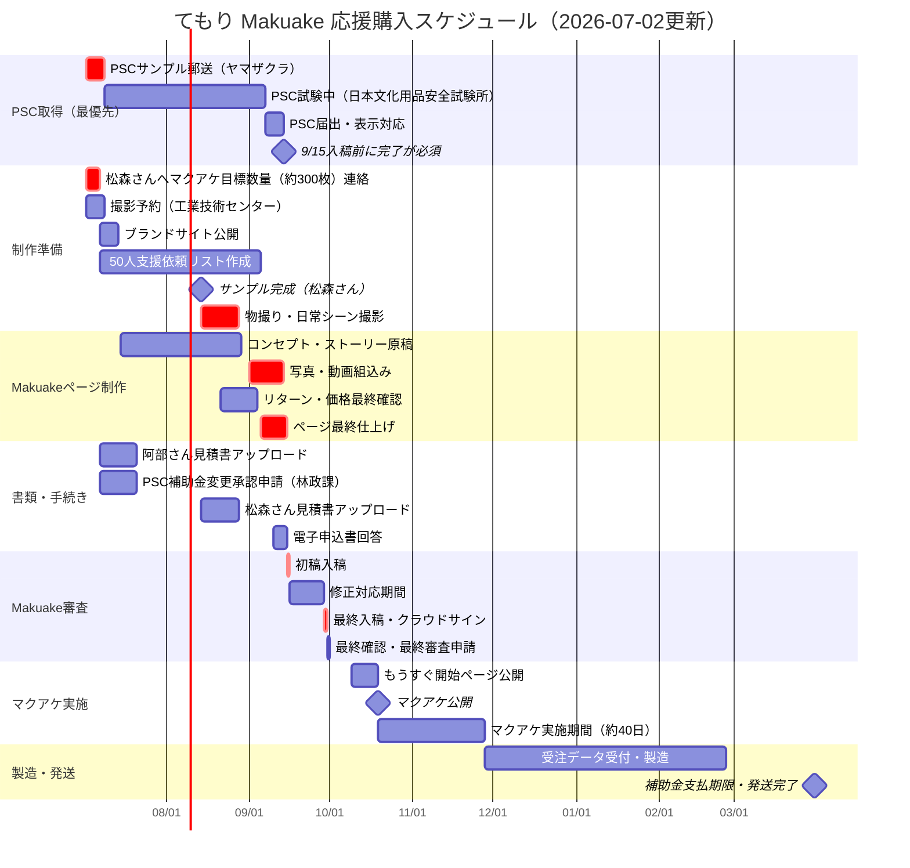

# てもり｜Makuake 応援購入プロジェクト ガントチャート v2

作成：2026-07-02　更新者：とうめいしっぽ（新田紗希）
※ v1（2026-05-25）よりキュレーター打合せ結果・PSC確認・サンプル完成8月中旬を反映して全面更新

> 🔴 **2026-07-17時点で要全面改訂：** 商品名・形状のピボット（もりんこ／8の字こけし、旧「てもり」／葉形パネルから変更）が決定・チームに伝達済み。以下の日程は葉形パネル前提の旧計画のため実態と合わなくなっている。特に：
> - **PSCサンプル郵送はまだ未実施**（下記ガントは7/2発送想定になっているが誤り）
> - **9/15入稿は「最短の目安」であり、実際の目標は2026年11月ごろ**
> - 4個セット／9体セットの構成単位（旧「4枚／9枚」）は変更なし
> 新スケジュールは松森さんとこけし型の製造工程・PSC試験計画を詰めたうえで再構築すること。以下は参考として残すが、日付は鵜呑みにしないこと。

---

## チーム

| 略称 | 担当 |
|------|------|
| 新田 | とうめいしっぽ（企画・販売・広報） |
| 松森 | 松森木工所（木工制作・NC加工・Webアプリ） |
| 阿部 | のはら（ブランドデザイン・パッケージ） |
| 本間 | manordaいわて（事業計画・外部調整） |
| しらたき | しらたき工房（梱包） |

---

## 確定済みマイルストーン

| 日付 | 内容 |
|------|------|
| **2026-07-02（今日）** | ← 現在地 |
| 2026-09-15（火）正午 | ★ Makuake初稿入稿・電子申込書・書類提出 |
| 2026-09-29（火）正午 | ★ Makuake最終入稿・クラウドサイン締結 |
| 2026-09-30（水）午前 | 最終確認・最終審査申請 |
| 2026-10-09（金） | 「もうすぐ開始」ページ公開 |
| **2026-10-19（月）** | ★★ マクアケ公開（確定） |
| 2027-03-31 | 補助金支払期限（発送完了必須） |

---

## ガントチャート

---

## フェーズ別タスク

### Phase 0｜完了済み（〜2026-07-01）

| タスク | 担当 | 状態 |
|--------|------|------|
| サンプル確認MTG（6/10） | 全員 | ✅ |
| 形状確定（はっぱ形有力・アンケートn=21） | 全員 | ✅ |
| 価格コース確定（6/30） | 新田・松森 | ✅ |
| 委託契約締結（松森木工所・ADC） | 新田 | ✅ |
| PSC：経産省照会・回答受領（6/26） | 新田 | ✅ |
| PSC：試験所リードタイム確認済み | 新田 | ✅ 7/2 |
| Makuakeキュレーター初回打合せ（7/1） | 新田 | ✅ |
| キュレーター確認：入稿前PSC取得でOK | 新田 | ✅ 7/1 |
| All In・表¥10万・裏¥80万・10/19開始 確定 | 新田 | ✅ 7/1 |

---

### Phase 1｜今すぐ（2026-07-02〜07-14）

| タスク | 担当 | 期限 | 備考 |
|--------|------|------|------|
| **PSCサンプル（ヤマザクラ）を試験所へ郵送** | 新田 | **今週中** | 最優先。遅れると9/15に間に合わない |
| **松森さんへマクアケ目標数量（約300枚）を連絡** | 新田 | **今週中** | 増産可否・追加コスト・リードタイムを確認 |
| 阿部さん（ADC）見積書を管理画面にアップロード | 新田 | 7/14 | 管理画面「書類をアップロードする」から |
| 工業技術センターの撮影予約（8月中旬〜下旬で確保） | 新田 | 7/14 | サンプル完成が8月中旬のため撮影は8月後半 |
| PSC：補助金変更承認申請（林政課・平賀さん） | 新田 | 7/14 | 広告費→試験費用への使途変更 |
| ブランドサイト公開（仮でもOK） | 新田 | 7/14 | 「もうすぐ開始」ページの誘導先になる |

---

### Phase 2｜制作（2026-07-15〜09-14）

| タスク | 担当 | 目安期限 | 備考 |
|--------|------|---------|------|
| Makuakeページ原稿（コンセプト・ストーリー） | 新田・本間 | 8月末 | 写真なしで先行して書き進める。「設計した」はOK・「監修」NG |
| リターン写真・商品説明（テキスト部分） | 新田・阿部 | 8月末 | テキストは先行・写真は撮影後に差し込み |
| パッケージデザイン | 阿部 | 8月 | 開封体験の演出を含む |
| **サンプル完成（松森さん）** | 松森 | **8月中旬** | ← ページ制作の写真がここで解禁 |
| **物撮り（工業技術センター）** | 新田・松森 | **8月中旬〜下旬** | サンプル完成後すぐ実施。予約は7/14までに確保 |
| **日常シーン・モデル撮影** | 新田 | **8月下旬** | コーディネート要 |
| **Webアプリの画面収録（松森さん）** | 松森 | **8月中旬〜下旬** | 2026-07-17アヤさん申し送り：⑥「模様が生まれる仕組み」用。データ入力→模様が立ち上がる様子の短い動画。物撮りと同時期に依頼すると「ついで」で済む |
| **写真・動画をページに組込み** | 新田 | **9/5まで** | ⚠️ここが最も詰まる。9/15まで10日しかない |
| 松森さん見積書アップロード | 新田 | 8月下旬 | サンプル完成後 |
| PSC：依頼書・申請者登録用紙を試験所に提出・振込 | 新田 | 林政課承認後すぐ | ST第1部¥30,000〜＋第2部¥5,000 |
| PSC：試験完了・報告書受領 | 試験所 | 9月初旬目標 | ここが詰まると10/19がずれる |
| PSC：届出（保安ネット）・表示対応 | 新田 | 9/14まで | オンライン推奨 |
| 50人支援依頼リスト作成 | 新田 | 9/1 | 初日2時間で裏目標×30%（約24万）達成が目標 |
| 活動レポート投稿日をカレンダー固定 | 新田 | 9/1 | マクアケ期間中1回＋終了後〜発送まで月1回（怠ると違反点数） |

---

### Phase 3｜審査（2026-09-15〜10-18）

| タスク | 担当 | 期限 | 備考 |
|--------|------|------|------|
| ★初稿入稿・電子申込書・書類提出 | 新田 | **9/15 正午** | リターン写真・テキスト完成版・PSC適合証明 |
| 修正対応 | 新田・本間 | 〜9/29 | 藤根さんからフィードバックが来る |
| ★最終入稿・クラウドサイン締結 | 新田 | **9/29 正午** | 以降リターン変更不可 |
| ★最終確認・最終審査申請 | 新田 | **9/30 午前** | 最終確認メール返信 |
| 量産材料発注・加工準備（先行） | 松森 | 10月 | マクアケ達成を前提に先行準備 |
| 梱包材・資材手配 | 新田・しらたき | 10月 | — |
| 公開前：支援者候補50人へ一斉連絡 | 新田 | 10/18 | 「もうすぐ開始」へ誘導 |

---

### Phase 4｜マクアケ実施（2026-10-09〜11月末）

| タスク | 担当 | 備考 |
|--------|------|------|
| 「もうすぐ開始」ページ公開 | 新田 | 10/9・「通知を受け取る」押してもらう |
| ★マクアケ公開・初日2時間の初速 | 新田 | 裏目標80万×30%≒24万を初日2時間で |
| SNS・PR発信（Instagram中心） | 新田 | 活動レポートはマクアケ以外の日常・裏側もOK |
| コメント対応（全件いいね・返信） | 新田 | — |
| プレスリリース送付 | 新田 | 盛岡経済新聞・子育てメディア等 |

---

### Phase 5｜製造・発送（2026-12月〜2027-03-31）

| タスク | 担当 | 備考 |
|--------|------|------|
| 顧客データ受付・模様生成 | 松森・新田 | Webアプリ運用 |
| NC加工・仕上げ | 松森 | 1枚約5分×9枚≒45分/セット |
| 梱包・発送 | 新田・しらたき | 配送完了期限：マクアケ終了月から半年以内 |
| ★発送完了 | 新田 | **2027-03-31 補助金支払期限** |

---

## ⚠️ リスク一覧

| リスク | 影響 | 対処 |
|--------|------|------|
| **サンプル完成8月中旬により撮影〜ページ完成が9/15まで3週間しかない** | **9/15入稿が最高難度** | **写真なしで書けるテキスト・リターン文を7〜8月に先行完成させておく** |
| PSC試験が9/15に間に合わない | マクアケ公開日が後ろ倒し確定 | 今週中にサンプル郵送・進捗を密に確認 |
| 松森さんの製造数（200〜230枚）が不足 | リターン個数上限を絞る必要あり | 今週中に約300枚で打診・追加コスト確認 |
| 活動レポートの未投稿 | 違反点数・最悪掲載不可 | カレンダー固定で忘れない運用を |
| ページに禁止表現が入る | 違反25点 | 阿部さんへ広告表現ルール共有を確認 |

---

## 参考：リターン構成・製造数シミュレーション

| コース | 価格 | 数量上限 | 必要枚数 |
|--------|------|---------|---------|
| 応援コース | ¥1,000 | 無制限 | 0枚 |
| お試し | ¥4,500 | 20 | 40枚 |
| スタンダード 超早割 | ¥9,800 | 10 | 40枚 |
| スタンダード 早割 | ¥11,000 | 15 | 60枚 |
| スタンダード 通常 | ¥13,000 | 10 | 40枚 |
| プレミアム | ¥24,000 | 10 | 90枚 |
| 相談コース | ¥29,800 | 3 | 27枚 |
| **合計** | — | — | **297枚** |

- 松森さん現製造数目安：約200〜230枚 → **約70〜100枚不足（増産交渉が必要）**
- シミュレーション合計：¥812,400（裏目標¥800,000 クリア）
- 表の目標金額：¥100,000（All In形式）

---

> v1（2026-05-25作成）は `20260525_doc_クラファンガントチャート_draft_v1.md` に保存